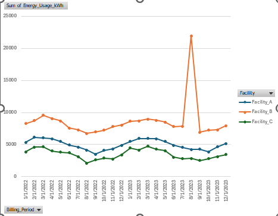

# Facility Energy Trend Analyzer

## Overview
This project models 24 months of energy consumption data across three facilities to track seasonal usage trends, verify peak billing cycles, and identify excessive utility usage anomalies. 

## Visualizing the Data

*The line graph above illustrates the 24-month energy consumption trends for three facilities. The visualization immediately flags a massive 15,000 kWh spike in August 2023 for Facility B, highlighting an anomaly that requires further investigation by the Energy Manager for potential billing errors or excessive usage.*

## Repository Files
* **`PythonApplication1.sln`**: The Visual Studio solution file containing the Python script engineered to generate and calculate monthly energy consumption, injecting seasonal variations and targeted usage spikes.
* **`energy_usage_records.csv`**: The raw exported dataset generated by the Python script, containing the dates, facility names, and calculated kWh usage.
* **`pivot_chart_line_graph.png`**: The exported Excel PivotChart used to visualize the trend data and compare facility usage over time.
* **`README.md`**: Project documentation and overview.

## Tools Used
* **Python (Pandas, NumPy):** Automated data generation, statistical variation, and dataset exporting.
* **Microsoft Excel:** Utilized PivotCharts to analyze raw data, visualize seasonal trends, and isolate utility anomalies.

## Objective
Designed as an auditing tool to help an Energy Manager quickly analyze utility usage patterns, determine opportunities for energy savings, and visually spot discrepancies that indicate excessive energy or utility usage.
